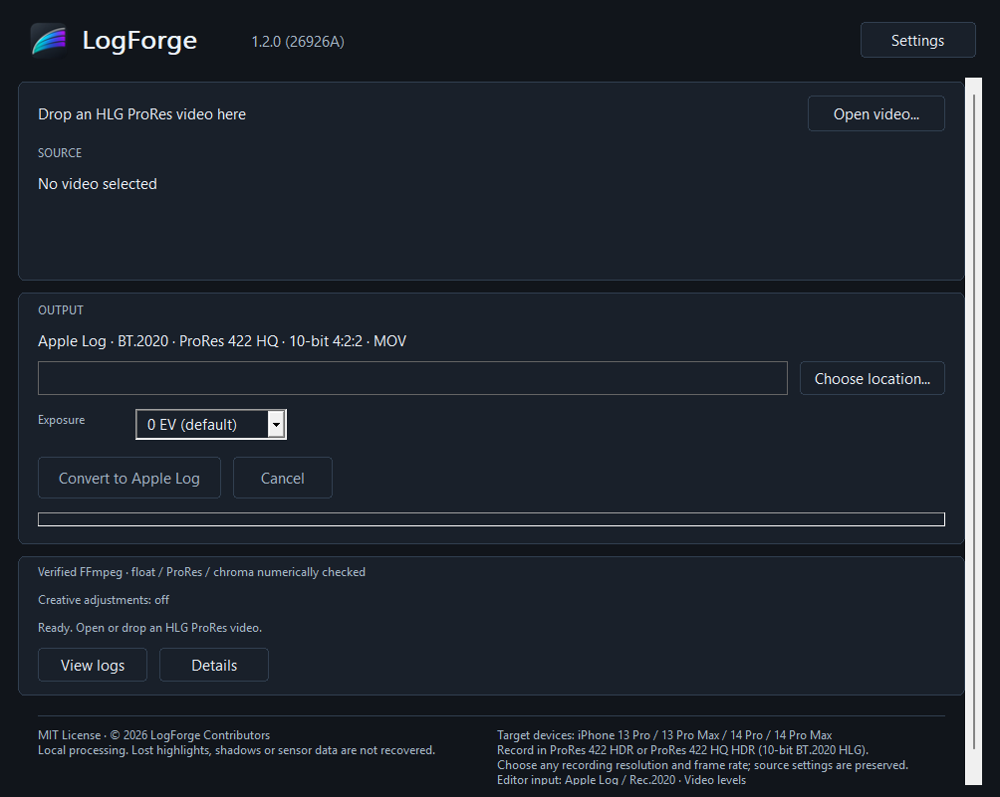

# LogForge

A small native Windows tool that re-encodes **BT.2020 HLG ProRes** into **Apple Log / BT.2020 ProRes 422 HQ** for a consistent grading workflow.

LogForge changes the pixels using published color mathematics. It does not restore clipped highlights, crushed shadows, tone-mapped-away detail, or information lost in a camera's ISP. It cannot turn processed phone footage into the original sensor capture.

**Version 1.2.0 · Build 26926A.** Output is **Apple Log / Rec.2020 with Video levels**. The identification fields were **verified in 1.1.0 with DaVinci Resolve Studio 20.3.2.9 on Windows**, using DaVinci YRGB Color Managed. The latest build's verification scope is recorded in [VALIDATION](docs/VALIDATION.md); historical editor evidence is not a fresh import test. This is Apple Log, not Apple Log 2 / Apple Wide Gamut. See the [native-reference and real-import evidence](docs/APPLE_LOG_IDENTIFICATION.md).



The screenshot uses an empty workspace; no personal video or camera image is included.

## What's new in 1.2.0

- **Portrait MOV fixes:** preserve movie/video/audio creation timestamps and source creationdate through all supported rotations. Compare timestamp meaning, and preserve drop-frame timecode during remux.
- **Media safeguards:** explicit QuickTime container and edit-list policy, chapter validation, unsupported display-matrix rejection, structural identification writing and first/middle/last pixel sanity sampling.
- **Processing backends:** Auto, CPU or NVIDIA RTX CUDA. The GPU accelerates precise color mathematics; ProRes decoding and encoding remain on the CPU. Auto falls back safely after GPU failures, while forced CUDA fails explicitly.
- **Measured CPU pipeline:** adaptive thread allocation and three bounded Standard buffers overlap decoding, color processing and encoding. Reports distinguish CPU time, color time, pipe waits, remux, metadata, validation and GPU copy/kernel timings. See the [benchmark](docs/BENCHMARK_1.2.0.md).
- **Batch conversion:** select/drop several videos; each gets its own validation report and a failed item does not stop later items.
- **Correct main-window layout:** one measured, scrollable layout separates source/output/status/footer, with a single renderer per status text and full relocation invalidation.
- **Storage reliability:** cross-process settings/trust locking, ownership-checked abandoned temporary-file recovery, bounded retention and report-directory preflight. No output is published after report failure.
- **Release integrity:** an actual `.zip.sha256` accompanies the ZIP, and packaging audits its contents and executable identity.

See [1.2.0 release details and limitations](docs/RELEASE_1.2.0.md). The Apple Log/HLG reference equations, BT.2408 scale, float32 intermediate, BT.2020, nclc 9/2/9, Video levels, packet cadence checks and color tolerances remain unchanged.

## Previous release: 1.1.1

- **Fast FFmpeg startup:** Quick discovery has a shared three-second filesystem budget. A verified managed/saved pair avoids later searches. Other sources include PATH, Windows App Paths, package installations, bounded common folders and the existing Windows Search index.
- **Deep search is explicit:** use **Deep search all drives** only when needed, or `LogForge-cli --detect --deep-search`. Startup never falls through to whole-drive traversal.
- **Review discovered candidates directly:** select a path from the candidate list, review the real executable pair and hashes, and approve before any tool runs. Missing probes and changed/incompatible tools retain their reasons. Search cancellation and failures restore download/manual/retry actions.
- **Supervised discovery:** potentially blocking filesystem/index queries run in a hidden mode of LogForge itself, with Job Object cancellation and deadlines. Discovery and verification times are reported separately; hashes and numerical qualification are still checked.
- **Reliability fixes:** descendant-held pipes remain cancellable after a parent exits; excessive output and reader exceptions fail safely. Mixed-case MOV extensions, numeric metadata bounds, temporary trust-file cleanup and worker-buffer allocation are corrected.
- **Regression audit:** see [confirmed defects and remaining limits](docs/BUG_AUDIT_1.1.1.md) and [actual verification](docs/VALIDATION.md). Apple Log/HLG equations, reference scaling, numerical tolerances and the Resolve identification writer are unchanged.

## Previous release: 1.1.0

Version **1.1.0 (26923C)** includes all changes beginning with the 29.99 fps CFR fix, including the verified Resolve Apple Log identification work. The Apple Log equations, inverse HLG OETF and BT.2408 reference scaling remain unchanged. See the [1.1.0 changelog](CHANGELOG.md) for the complete release scope.

- **Fixed false VFR detection:** fixed-cadence 29.99, 29.98 and 29.9701 fps footage is accepted even when average and nominal rate tags differ. Every video packet is checked for PTS, duration, interval and cumulative phase; true VFR, gaps, duplicate/backwards timestamps and sustained drift are rejected with a packet-specific reason.
- **Safer FFmpeg discovery:** scanning discovers paths without executing unknown programs. A verified managed download or explicit user approval is required. Approval binds both executable paths and SHA-256 hashes; changed files require approval again. Execution uses the locked canonical pair, including protection against an unapproved ffprobe beside an executable alias.
- **Numerical FFmpeg qualification:** small reference signals check matrix/range conversion, left/center chroma phase and ProRes encode/decode results. Only **Verified FFmpeg** may transcode; **Compatible but unverified FFmpeg** is available for inspection.
- **Metadata whitelist:** format, video and audio tags follow an explicit safe-copy policy. Source creation time, real camera make/model and timecode can be preserved; conflicting HLG/HDR/Dolby/PQ/custom-gamma fields are removed and recorded.
- **Explicit chroma handling:** input left/center siting is passed to the conversion filter. Missing siting requires a user declaration, unsupported siting is rejected, and output validation records its declaration and numerical phase evidence.
- **Better reference MOV analysis:** resolve `meta/keys/ilst/mdta/data` entries into key names and typed values, inspect ProRes sample-entry extensions, and compare semantic metadata with `--analyze A B` without treating file sizes or byte offsets as meaningful differences.
- **Verified Resolve Apple Log identification:** a separate writer adds the native-reference `logs` sample-entry identifier after encoding. Actual Resolve A/B imports establish the minimal field; the color math, nclc 9/2/9, Video levels, encoder identity and original camera metadata remain unchanged. Native video-description terminators are now parsed correctly.
- **Lower-memory, parallel CPU processing:** the standard path streams at most 4 MiB of float samples through persistent workers; Creative adjustments use parallel RGB tiles. Results are tested for exact float equality with the scalar implementation.
- **Stronger output validation:** JSON reports include average/nominal rates, verified cadence, maximum timing errors, FFmpeg identity/trust, chroma evidence and preserved/removed metadata. Publication also refuses a destination created while conversion is running.
- **Expanded regression coverage:** timing edge cases, untrusted executable non-execution, hash changes, metadata parsing/conflicts, chroma siting, drop-frame timecode, multiple audio streams, 180/270-degree rotation, post-encode numeric sampling and a 240-frame 4K120 conversion.

Automatic identification was checked with an unmodified iPhone 15 Pro Max / Blackmagic Camera original, a negative LogForge baseline, isolated metadata candidates and a real converted output. No camera model or Apple encoder is spoofed. Other Resolve versions/editions, Premiere and Final Cut remain unverified. See the [metadata contract](docs/METADATA.md) and [validation record](docs/VALIDATION.md).

## Features

- Native Win32 GUI, file dialogs, Unicode paths and file drag-and-drop.
- Bounded Quick FFmpeg discovery and optional manual Deep search; explicit path/hash approval before external tools may run, plus a pinned HTTPS installer.
- Numerical FFmpeg qualification (matrix, range, left/center chroma phase and post-ProRes code values).
- English (default) and Simplified Chinese; dark (default) and light themes, saved in Settings.
- Original spectrum-and-curve icon; Windows version 1.2.0.0 and in-app build display 1.2.0 (26926A).
- Runtime-qualified CPU/CUDA color processing, a serial multi-file queue and detailed per-job reports.
- Double-precision Apple Log and inverse HLG math; 32-bit float RGB transport.
- ProRes HQ 10-bit 4:2:2 MOV output; audio packet copy, frame rate and raster preservation.
- Timecode, creation metadata, original Make/Model and ordinary rotation preservation.
- Actual FFmpeg frame/time progress, cancellation, supervised child processes.
- Automatic output checks, local diagnostic logs and JSON validation reports.
- Optional shadow lift, highlight compression and saturation adjustment, with a separate enable switch; unchanged Apple Log encoding follows the creative adjustment.
- Per-component signal-range accounting over every frame, with visible warnings for Apple Log floor clipping or above-nominal-white signals.
- A developer CLI and a MOV atom / metadata comparison tool.

## Install and run

1. Download `LogForge-1.2.0-Windows-x64.zip` and its `.sha256` file from this project's GitHub Releases when published.
2. Extract the ZIP and run `LogForge.exe`. No installer or administrator rights are required.
3. Let LogForge discover FFmpeg paths. Unapproved programs are **not executed**. Use **Review FFmpeg...** to select a discovered candidate and review both SHA-256 hashes, then explicitly approve it. If none is usable, retry Quick search, explicitly start Deep search, choose a file manually, or use **Download FFmpeg** for the pinned build. Buttons disappear after approved tools pass numerical verification. An old saved path alone is not execution approval.
4. Open or drop supported videos. If chroma siting is absent, explicitly confirm left or center from your recording/export settings; cancel if unknown. Choose a new output `.mov` for one file, or an output directory for a queue, then select **Convert to Apple Log**.
5. Wait for output validation. An existing output file is never overwritten.

The executable is unsigned. Windows may show an unrecognized-publisher prompt. The Release build uses the static MSVC runtime (`/MT`); no separately installed VC++ runtime is required by LogForge. Windows 10 22H2 / Windows 11 x64 is the supported target. ARM64, macOS and Linux are not supported in v1.

The source build also produces `LogForge-cli.exe`; this developer tool is not required for the portable GUI release.

For exposure matching, keep **0 EV** unless you have a deliberate reason to adjust it. A positive offset lifts scene exposure before Apple Log encoding. It does not correct unknown camera rendering or certify a native-camera match. In the developer CLI, use `--exposure-ev 1` for +1 stop, for example.

## Settings

Open **Settings** in the top right:

- **Language:** English or Simplified Chinese. English is the first-run default, independent of the Windows display language.
- **Appearance:** Dark or Light. Dark is the first-run default.
- **Processing backend:** Auto (default), CPU or NVIDIA RTX CUDA. Auto tries a usable CUDA device and falls back to CPU with a recorded reason. Forced CUDA reports failure if unavailable or unqualified. The app uses the installed NVIDIA driver; no bundled CUDA runtime or Toolkit is required.
- **Creative adjustments:** Off by default. Enable to lift shadows, reduce highlights and adjust saturation; the initial values are **3 EV / 1 EV / 85%**. The detailed controls appear when enabled and retain their values when disabled.

**Save** applies changes immediately and persists them for the next launch. **Cancel** discards changes. Settings are disabled during discovery, downloads, probing or conversion. Windows-owned file pickers and operating-system error text may use the Windows language.

Creative adjustment is an intentional grade applied before the unchanged Apple Log encoding, not a native-camera appearance match. Turning it off restores the standard conversion. See the [equations and limits](docs/CREATIVE_ADJUSTMENTS.md). Exposure remains a separate control on the main window. Status, errors, progress details, license and local-processing notes appear at the bottom left; recording requirements and editor assignment appear at the bottom right.

## Supported input

| Property | V1 requirement |
| --- | --- |
| Container | Nonfragmented QuickTime MOV with `qt  ` major brand |
| Codec | ProRes 422 (Standard) or ProRes 422 HQ |
| Pixel format | `yuv422p10le`, 10-bit 4:2:2 |
| Primaries / matrix | BT.2020 / BT.2020 non-constant luminance |
| Transfer | Explicit HLG (`arib-std-b67`) |
| Range | Explicit video or full range |
| Timing | One progressive video stream, fixed cadence verified from every packet's PTS, duration, interval and cumulative phase |
| Chroma location | Explicit left or center; unspecified requires a user declaration and is otherwise rejected |
| Resolution | Even width, up to 8192 × 8192; no resize |
| Frame rate | Valid rational frame rate, at most 120 fps |

The listed target devices are **iPhone 13 Pro, iPhone 13 Pro Max, iPhone 14 Pro and iPhone 14 Pro Max**. Record **ProRes 422 HDR or ProRes 422 HQ HDR (10-bit BT.2020 HLG)**. Choose your recording resolution and frame rate freely within the format guards above; LogForge preserves the source settings and does not force 4K or 24 fps. Admission depends on actual media parameters, not a model-name allowlist. VFR, HEVC/Dolby Vision, PQ, SDR, interlaced footage, ProRes LT/Proxy/4444 and missing/ambiguous color tags are refused. Chapters are copied and validated. Nonessential metadata/data tracks are removed with a report entry. Only unit rotations are supported; mirrors, scaling, translation, perspective and nonidentity movie-level transforms are refused. Edit lists must be zero-origin unit-rate duration declarations or packet-confirmed AAC priming; timeline trims, empty edits, repeats and speed changes are refused. Additional audio streams are copied when MOV supports their codecs; otherwise conversion fails visibly.

Identical packet durations/intervals establish the exact rational cadence, including 29.99, 29.98 and 29.9701 fps, even when average/nominal tags disagree. Timing checks retain a 1.05-tick maximum error around a candidate for nonuniform clocks; sustained phase drift, gaps and duplicate/reverse PTS are refused with a packet index. The float pipeline normalizes that small timing difference; it does not preserve arbitrary VFR timestamps. See [timing policy](docs/ARCHITECTURE.md#timing-and-publication).

## Output format and Apple Log workflow

- QuickTime MOV, ProRes `apch` / 422 HQ, 10-bit 4:2:2, BT.2020.
- Original resolution, rational fps and video frame count; audio is copied without re-encoding.
- Apple Log encoded RGB is mapped into **video-range YCbCr** (Y 64–940, C 64–960 nominal in 10-bit). Normalize these levels before applying an Apple Log LUT.
- `colr` is `nclc 9 / 2 / 9`: BT.2020 / unspecified transfer / BT.2020 matrix. `2` is deliberately honest; it is not an Apple Log ID. LogForge's own `logforge.transfer=Apple Log` metadata records intent but is not an Apple private identifier.
- The ProRes sample entry additionally contains `logs = com.apple.rec2020.apple-log`, observed in a camera original and independently verified by Resolve import.
- In **DaVinci YRGB Color Managed**, the tested Resolve version automatically detects **Apple Log** (Rec.2020 gamut). Its Auto data-level interpretation matched an explicit Video control in a real render. Use one technical input conversion; avoid adding a redundant CST or Apple Log-to-display LUT after managed conversion.
- Unmanaged DaVinci YRGB still needs an intentional viewing transform, such as Rec.2020 / Apple Log input in a CST. Identification and display conversion are different operations. Other editors/versions must be checked separately before assuming automatic behavior.

**Exposure reference:** 75% normalized HLG is interpreted as 100% scene reflectance, following the nominal reference in BT.2408. At zero exposure offset, an 18% gray reference maps from HLG 0.378259 to Apple Log 0.488272. This does not establish the phone's original metering or ISP behavior. Use the **Exposure** control only for an intentional exposure adjustment; zero is the default. The standard path applies inverse OETF and a scene-linear gain, without a display OOTF, tone mapping, saturation changes or gamut conversion. Optional creative rendering is applied only when explicitly enabled and is recorded in output metadata. See [color mathematics and monitoring](docs/COLOR_PIPELINE.md).

## How FFmpeg works

The release ZIP contains **no FFmpeg binaries**. Quick discovery searches managed/saved paths, app-adjacent tools, PATH, App Paths, actual WinGet/Scoop/Chocolatey installations, bounded common folders and the existing Windows Search index. It never starts a full-drive search automatically. Deep search of accessible local drives is an explicit user action. It records unknown paths without running them. Only a pinned, SHA-256-verified download or an explicitly approved pair may execute. Approval is stored separately as canonical paths plus SHA-256 for **both ffmpeg and ffprobe**; changes require approval again. While in use, deny-write/delete handles protect the approved executable images. Network shares, inaccessible/offline directories and reparse subdirectories are excluded from disk traversal; skipped locations are reported.

A compatible feature list is not sufficient for conversion. **Verified FFmpeg** additionally passes integer-signal matrix/range tests, half-pixel chroma tests and ProRes HQ encode/decode sampling. **Compatible but unverified FFmpeg** may be inspected but cannot transcode. Failed numerical tests are errors, never warnings. See [trust and provider details](docs/FFMPEG_PROVIDER.md).

The Standard path uses three chunks of at most 4 MiB each to overlap CPU decode,
color transform and CPU encode. Creative adjustment retains one planar float32
frame so RGB channels stay correctly paired. CPU workers use the unchanged scalar
equations. CUDA uses precise double expressions with float32 transport and must
pass independent reference qualification. CPU operation remains available without
a GPU. No fast math, FP16 or LUT approximation is used.

The installer currently pins **Gyan.dev FFmpeg 8.1.2 essentials**, a third-party Windows build, **GPLv3**. Download size is 109,728,040 bytes (about 105 MiB). HTTPS, embedded SHA-256, bounded retries, byte progress, extraction and post-install capability checks are implemented. It does not update PATH or install system components. Files are stored under:

```text
%LOCALAPPDATA%\LogForge\tools\ffmpeg\ffmpeg-8.1.2-essentials_build\
```

The provider interface allows controlled future version/source changes; this is intentionally not a floating "latest" URL. See [provider and licensing details](docs/FFMPEG_PROVIDER.md). FFmpeg.org supplies source and links to third-party Windows builds; it does not publish this binary.

## Build from source

Prerequisites: Visual Studio 2022 C++ desktop workload, Windows SDK 10.0.22621 or newer, CMake 3.24+, Git. Python 3 is needed only for optional generated-media integration tests. The small nlohmann/json dependency is vendored; configure/build performs no dependency download.

```powershell
cmake -S . -B build -G "Visual Studio 17 2022" -A x64
cmake --build build --config Release --parallel
ctest --test-dir build -C Release --output-on-failure
.\build\Release\LogForge.exe
```

For the full integration suite, supply an FFmpeg build you trust. Test runners explicitly approve that selected pair in isolated test profiles; they do not approve arbitrary scan results. Tests generate their own signals, including 240 frames of 4K120, and need several minutes and free disk space:

```powershell
cmake -S . -B build -DLOGFORGE_TEST_FFMPEG="C:/ffmpeg/bin/ffmpeg.exe"
cmake --build build --config Release --parallel
ctest --test-dir build -C Release --output-on-failure
```

Generate the small portable package:

```powershell
cpack --config build/CPackConfig.cmake -C Release -B dist
python tests/package_audit.py --zip dist/LogForge-1.2.0-Windows-x64.zip --exe build/Release/LogForge.exe
```

Pushes and pull requests configure/build/test on Windows. Every build creates a ZIP artifact; version tags must match the CMake version, and the workflow does not silently publish a GitHub Release. See [validation details](docs/VALIDATION.md) and [architecture](docs/ARCHITECTURE.md).

On an interactive Windows desktop, run the native settings/theme/language suite:

```powershell
python tests/gui_smoke.py --exe build/Release/LogForge.exe --ffmpeg C:/ffmpeg/bin/ffmpeg.exe --work build/gui-check
```

After the integration suite has generated its fixtures, add `--input build/integration/standard.mov` to test the actual drop-to-conversion flow in both standard and creative modes. Test hooks capture only LogForge windows and use an isolated `LOGFORGE_DATA_DIR`. The explicitly injected missing-FFmpeg UI case does not replace the real disk-discovery/capability tests. No personal recordings are needed.

## Local diagnostics and reference analysis

Logs, settings, transient files and validation JSON are stored under `%LOCALAPPDATA%\LogForge`. Nothing is uploaded. Logs contain media filenames, commands and media properties; review them before sharing. A custom `LOGFORGE_DATA_DIR` environment variable is supported for isolated test runs.

```powershell
.\build\Release\LogForge-cli.exe --detect
.\build\Release\LogForge-cli.exe --probe "input.mov"
.\build\Release\LogForge-cli.exe --convert "input.mov" "output_AppleLog.mov"
.\build\Release\LogForge-cli.exe --analyze "output_AppleLog.mov" "real_AppleLog_reference.mov" > comparison.json
```

The CLI also provides `--version`, `--help` and `--language en|zh-CN`; English is the CLI default. Pass `--ffmpeg "C:\path\ffmpeg.exe"` to select an explicitly approved build. `--install-ffmpeg` exercises the GUI installer. Reference analysis includes raw atoms/probe data plus a semantic diff of resolved metadata and stream parameters; it does not guess unknown private meanings or assert binary equivalence.

## Limits and next validation

- A private iPhone HDR clip was used for earlier regression fixes; its test derivatives have been removed and are excluded from source and packages. Routine regression tests use generated media. The public camera reference used for Resolve metadata testing is also excluded from source/packages.
- No claim of native sensor dynamic range, recovery of clipped data, Apple encoder identity, camera certification, or exact iPhone MOV atom equivalence.
- Resolve Studio 20.3.2.9 managed import is verified. Premiere, Final Cut, other Resolve versions and native-camera appearance matching remain separate validation tasks.
- CPU float processing favors a verifiable reference implementation. No GPU acceleration, batch queue, preview player or HDR display pipeline is included.
- Large/long camera files, uncommon edit lists and unusual audio layouts need additional coverage. The validator fails closed when required preservation checks differ.

Highest priority: repeat the controlled metadata import test in other Resolve versions, Premiere and Final Cut; obtain matched HLG/native-Log captures for exposure and camera-rendering comparisons.

## Developer CLI approval and analysis

```powershell
.\build\Release\LogForge-cli.exe --approve-ffmpeg --ffmpeg C:\ffmpeg\bin\ffmpeg.exe
.\build\Release\LogForge-cli.exe --detect --ffmpeg C:\ffmpeg\bin\ffmpeg.exe
.\build\Release\LogForge-cli.exe --convert input.mov output.mov --ffmpeg C:\ffmpeg\bin\ffmpeg.exe --input-chroma-location left
.\build\Release\LogForge-cli.exe --analyze output.mov reference.mov --ffmpeg C:\ffmpeg\bin\ffmpeg.exe
```

`--approve-ffmpeg` is an explicit execution authorization. Review the selected files first. Omit `--input-chroma-location` when ffprobe reports a supported siting; an override is for a known but unlabelled source, not a guess. `--check-compatible --ffmpeg PATH` reports capability-only status without certifying numeric behavior. The analyzer resolves metadata key indices, values and ProRes extensions; its semantic diff ignores `mdat` offsets and file sizes. No native Apple sample is bundled.

## License and trademarks

LogForge source is [MIT](LICENSE). See [third-party notices](THIRD_PARTY_NOTICES.md) for nlohmann/json and the independently obtained FFmpeg tools. GPL FFmpeg is a separate executable, not linked into LogForge; downloading it does not relicense its components under MIT. Redistributing FFmpeg yourself entails its own license/source obligations.

LogForge is an independent open-source project and is not affiliated with or endorsed by Apple Inc.

Apple, ProRes and Apple Log are trademarks of their respective rights holders. This project does not use the Apple logo. Software is provided without warranty; assess results against your own delivery requirements. Patent/trademark rights are not granted by the MIT license.
